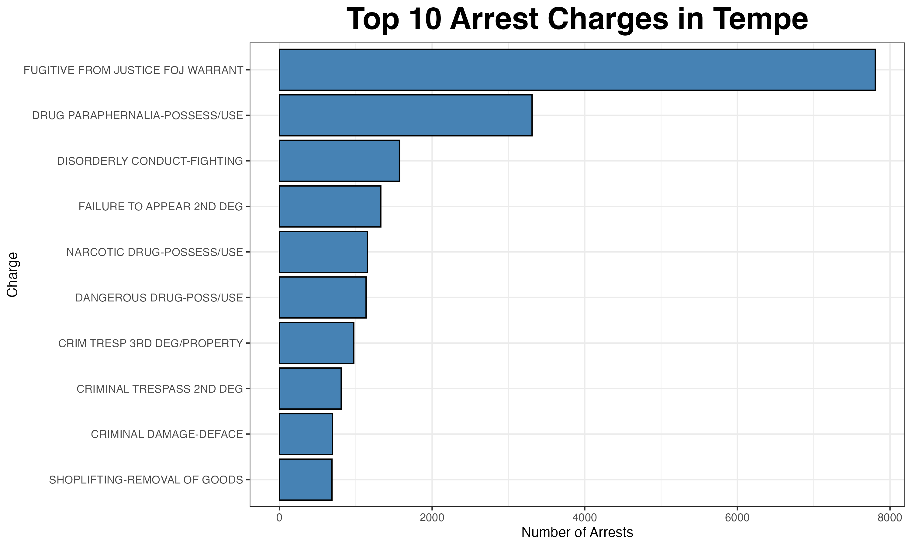
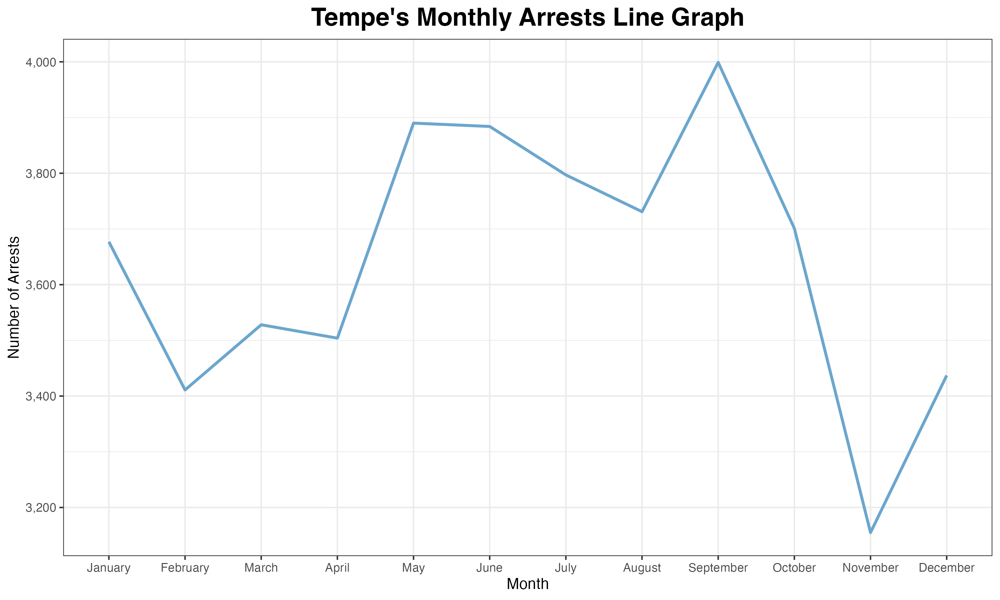
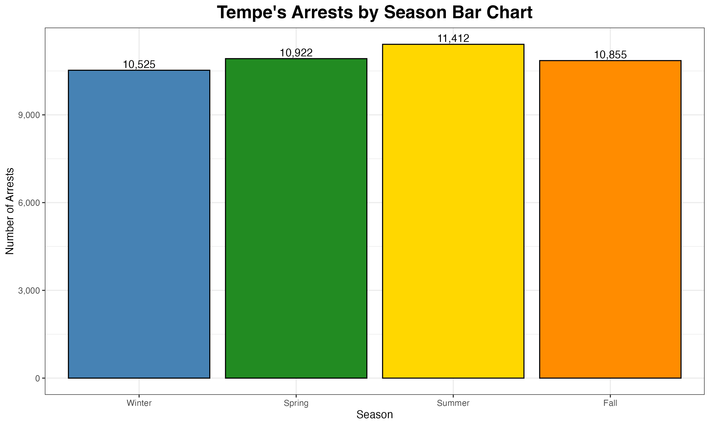
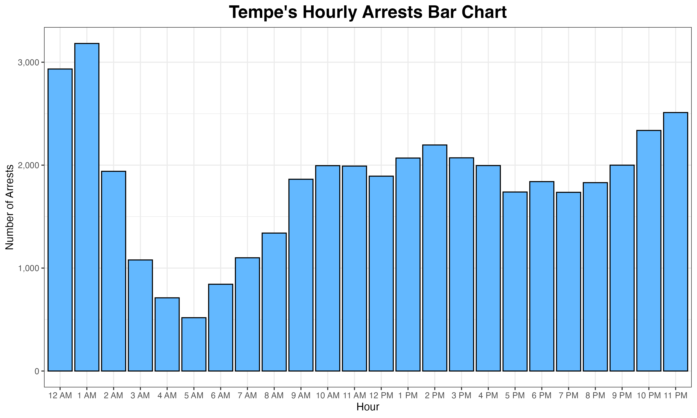
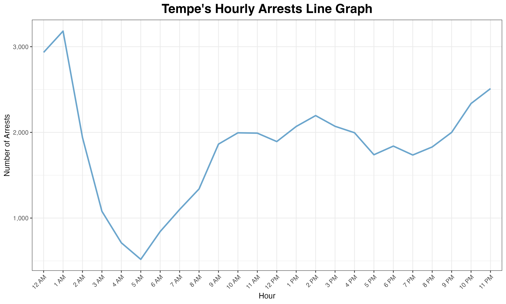
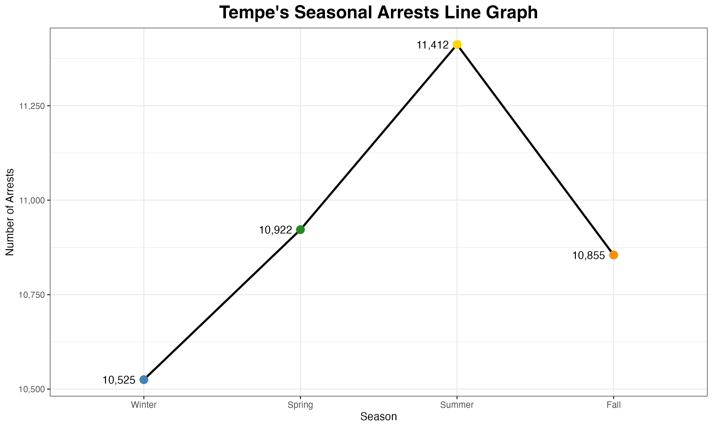

# Tempe Arrest Analysis

## Project Overview

**Dataset Period:** May 28, 2023 – May 26, 2026

This project analyzes 43,000+ arrest records from the Tempe, Arizona Open Data 
Portal to identify geographic arrest hotspots, seasonal patterns, hourly trends,
and the most common arrest charges.

Using R, the project demonstrates a complete end-to-end data analytics workflow,
including:

* Data cleaning
* Feature engineering
* Exploratory data analysis (EDA)
* Interactive data visualization
* Geographic analysis using Leaflet
* GitHub Pages deployment of interactive dashboards
---

## Business Problem

Public safety agencies collect thousands of arrest records every year, but raw 
data alone provides limited insight into when, where, and how arrests occur. 
Without effective analysis and visualization, identifying meaningful patterns is 
time-consuming and difficult.

This project transforms nearly three years of arrest data into interactive 
visualizations and geospatial analyses that help answer questions such as:

* Which arrest charges occur most frequently?
* When do arrests occur most often throughout the year?
* What hours experience the highest arrest activity?
* Which streets experience the highest number of arrests?
* Where are arrest hotspots geographically concentrated?

## Key Findings

* Fugitive from Justice warrants were the most common arrest charge in the dataset.
* Arrest activity remained relatively consistent throughout the year with only 
modest seasonal variation.
* Arrest frequency peaked during overnight hours around 1:00 AM.
* Major transportation corridors such as Mill Avenue, Apache Boulevard, and
Baseline Road accounted for many of the highest-arrest locations.
* Geographic hotspot analysis revealed concentrated clusters of arrests rather
than a uniform spatial distribution.

## 🌐 Interactive Dashboard

Explore the interactive visualizations created during this analysis.

| Visualization | Launch |
|:---|:---:|
| 🏠 Project Homepage | [Open](https://acal05.github.io/tempe-crime-analysis/) |
| 📊 Top 10 Arrest Charges | [Open](https://acal05.github.io/tempe-crime-analysis/top_charges.html) |
| 📅 Monthly Arrest Trends | [Open](https://acal05.github.io/tempe-crime-analysis/monthly_arrests.html) |
| 🕒 Hourly Arrest Trends | [Open](https://acal05.github.io/tempe-crime-analysis/hourly_arrests_line.html) |
| 📈 Hourly Arrest Bar Chart | [Open](https://acal05.github.io/tempe-crime-analysis/hourly_arrests_bar.html) |
| 📍 Top Arrest Locations | [Open](https://acal05.github.io/tempe-crime-analysis/top_locations.html) |
| 🔥 Geographic Arrest Heat Map | [Open](https://acal05.github.io/tempe-crime-analysis/arrest_heat_map.html) |

> Hover over points, bars, and map regions to explore the underlying data interactively.

## Source

City of Tempe Open Data Portal

### Dataset Contents

The dataset contains more than 43,000 arrest records collected between
May 28, 2023 and May 26, 2026.

Key variables include:

- Arrest date and time
- Arrest charge
- Arrest type
- Geographic coordinates
- Street location
- Incident identifier (`rin`)

# Analysis

## 1. Geographic Arrest Density Heat Map

### Question

> **Where are arrest incidents geographically concentrated throughout the dataset?**

### Figure

### Interactive Visualization

🌐 **Interactive Version:** [Open the Geographic Arrest Heat Map](https://acal05.github.io/tempe-crime-analysis/arrest_heat_map.html)

### Key Findings

* Arrest activity is concentrated in several distinct geographic hotspots rather
  than being distributed evenly throughout the dataset.
* Higher-density areas appear along major commercial and transportation corridors.
* The heat map reveals localized spatial patterns that are difficult to identify 
from street-level arrest totals alone.
* The interactive version allows users to zoom and explore arrest-density patterns
at different geographic scales.

### Methodology

The original dataset was stored at the charge level, meaning a single arrest 
could appear in multiple rows when multiple charges were recorded. 
The mapping dataset was reduced to one row per unique arrest incident using the `rin` identifier.

The original projected coordinates were assigned the EPSG:2223 coordinate 
reference system and transformed to WGS 84 latitude and longitude coordinates 
using the `sf` package. The interactive heat map was then created with `leaflet` 
and `leaflet.extras`.

### Business Interpretation

This visualization highlights geographic concentrations of arrest activity that 
are not immediately apparent from tabular data alone. Spatial analyses like this 
can help identify areas that experience consistently higher levels of enforcement 
activity or arrest volume and provide a foundation for additional geographic analysis.

### Dataset Note

The map represents the complete arrest dataset as provided. Some coordinates 
appear outside Tempe’s municipal boundaries. These records were retained to
maintain consistency with the other analyses in the project.

## 2. Top 10 Arrest Charges (Bar Chart)

### Question

> **Which arrest charges occur most frequently throughout the dataset?**

### Figure

### Key Findings
* Fugitive from Justice (FOJ) Warrant is by far the most common arrest charge, 
accounting for 7,807 arrests, more than double the second most common offense.
* Several of the most common charges involve warrants, drug offenses, and 
property-related crimes rather than violent offenses.
* The large difference between the first and second ranked charges suggests 
warrant enforcement contributes substantially to overall arrest activity.

### Business Interpretation

Understanding which arrest charges occur most frequently helps identify the 
types of incidents that account for the largest share of enforcement activity.
This information can support trend monitoring, resource planning, and future
analyses focused on changes in arrest patterns over time.

### Interactive Visualization

🌐 **Interactive Version:** [Open the Top 10 Arrest Charges Chart](https://acal05.github.io/tempe-crime-analysis/top_charges.html)

## 3. Monthly Arrest Patterns (Line Graph)

### Question

> **How does arrest activity vary throughout the year?**

### Figure

### Key Findings

* Arrest activity gradually increases from spring through early fall before
declining toward the end of the year.
* September records the highest number of arrests (3,999), while November 
records the lowest (3,155).
* The variation across months is moderate, suggesting arrests occur consistently 
throughout the year rather than being concentrated in one season.

### Business Interpretation

Understanding monthly arrest trends helps identify recurring seasonal patterns
and periods of increased activity. While the data does not show extreme seasonal 
swings, recognizing months with relatively higher arrest volumes can support 
future trend analysis and long-term planning.

### Interactive Visualization

🌐 **Interactive Version:** [Open the Monthly Arrest Trends](https://acal05.github.io/tempe-crime-analysis/monthly_arrests.html)## 4. Seasonal Arrest Patterns

### Question

> **How does arrest activity vary across the four seasons of the year?**

### Figure 1 – Seasonal Arrests (Bar Chart)

### Figure 2 – Seasonal Arrests (Line Graph)

### Key Findings

* Arrest totals remain relatively consistent across all four seasons.
* **Summer** recorded the highest number of arrests (**11,412**), 
while **Winter** recorded the lowest (**10,525**).
* Seasonal differences are relatively modest, suggesting that arrest activity 
remains relatively stable throughout the year.
* The line graph emphasizes the gradual increase in arrests from Winter through 
Summer before a slight decline in Fall, while the bar chart makes comparing 
seasonal totals easier.

### Business Interpretation

Examining arrest activity by season provides a higher-level view of long-term 
trends. Although Summer experiences the greatest number of arrests, 
the relatively small differences between seasons suggest that seasonal 
effects alone do not strongly influence overall arrest activity.

### Interactive Visualization

The monthly and hourly visualizations available in the Interactive Dashboard 
provide additional temporal detail for exploring arrest trends throughout 
the dataset.

## 5. Hourly Arrest Patterns

### Question

> **How does arrest activity change throughout a typical 24-hour day?**

### Figure 1 – Hourly Arrests (Bar Chart)

### Figure 2 – Hourly Arrests (Line Graph)

### Key Findings

* Arrest activity peaks during the overnight hours, with the highest number of 
arrests occurring around **1:00 AM**.
* Arrest counts decline sharply during the early morning hours before gradually 
increasing throughout the afternoon and evening.
* A secondary period of elevated arrest activity occurs during the late afternoon 
and evening, indicating that arrests are not distributed evenly throughout the day.
* The bar chart highlights differences in hourly arrest totals, while the line 
graph makes the overall daily trend easier to recognize.

### Business Interpretation

Hourly arrest patterns provide insight into when enforcement activity and arrests are most concentrated throughout the day. Identifying periods of increased arrest activity can support operational planning, staffing decisions, and future analyses comparing temporal trends across different offense categories or geographic locations.

### Interactive Visualizations

🌐 **Interactive Line Chart:** [Open the Hourly Arrest Trends](https://acal05.github.io/tempe-crime-analysis/hourly_arrests_line.html)

🌐 **Interactive Bar Chart:** [Open the Hourly Arrest Bar Chart](https://acal05.github.io/tempe-crime-analysis/hourly_arrests_bar.html)

## 6. Top Arrest Locations

### Question

> **Which streets recorded the highest number of arrests throughout the dataset?**

### Figure

### Key Findings

* **S Mill Avenue** recorded substantially more arrests than any other roadway 
in the dataset.
*  Several major transportation corridors—including 
**Baseline Road, Apache Boulevard, Scottsdale Road, and Rural Road**—appear 
among the highest-arrest locations.
* Arrest activity is concentrated along high-traffic commercial and 
transportation corridors rather than being evenly distributed across the city.
* Removing street address numbers allowed arrests occurring at different 
addresses along the same roadway to be analyzed together, providing a clearer
picture of roadway-level arrest activity.

### Business Interpretation

Analyzing arrests by roadway highlights geographic corridors that experience consistently higher levels of arrest activity. Aggregating locations by street rather than individual addresses provides a broader understanding of spatial patterns and can support future geographic analyses, hotspot identification, and trend monitoring.

### Interactive Visualization

🌐 **Interactive Version:** [Open the Top Arrest Locations Chart](https://acal05.github.io/tempe-crime-analysis/top_locations.html)

## Technologies Used
These tools were used for data cleaning, feature engineering, 
statistical analysis, geospatial visualization, 
interactive dashboard development, and project deployment.
### Programming

- R

### Development

- RStudio
- Git
- GitHub

### Libraries

- tidyverse
- ggplot2
- lubridate
- plotly
- leaflet
- leaflet.extras
- sf
- stringr
- htmlwidgets
- scales

## Author

Abigail Calvert

Data Science Student  
Arizona State University 